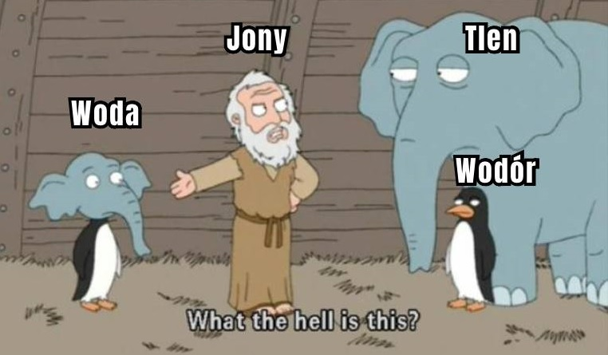

<!DOCTYPE html>
<html lang="pl">
<head>
    <meta charset="UTF-8">
    <meta name="viewport" content="width=device-width, initial-scale=1.0">
    <title>Plusy i minusy jonów</title>
    <link rel="stylesheet" href="124styl.css">
</head>
<body>
    <header>
        

            <h1>Plusy i minusy jonów</h1>
            
Aniony, kationy i przewodzenie prądu przez roztwory

        

    </header>

    <main>
        <section class="slide">
            <h2>Plusy i minusy... co?</h2>
            
Nazywając jony „plusami” i „minusami”, mamy na myśli ich ładunek elektryczny. Jony to nic innego jak atomy mające ładunek. Zachowują się więc jak elektrody, i dzielimy je na kationy i aniony.

            

                
            

        </section>

        

            

                <h3>„Plusy”, czyli kationy</h3>
                
Kationy to jony o dodatnim ładunku elektrycznym. Powstają w wyniku oderwania się jednego lub więcej elektronów od atomu.

                
Na⁺ (sód)

                
Ca²⁺ (wapń)

                
H⁺ (proton, często spotykany w kwasach)

            

            

                <h3>„Minusy”, czyli aniony</h3>
                
Aniony to jony o ujemnym ładunku elektrycznym. Są to atomy, które przyjęły jeden lub więcej elektronów.

                
Cl⁻ (jon chlorkowy)

                
OH⁻ (jon wodorotlenowy)

                
SO₄²⁻ (jon siarczanowy)

            

        

        <section class="slide">
            <h2>Co to jest dysocjacja elektrolityczna?</h2>
            
Dysocjacja elektrolityczna to proces, w którym cząsteczki substancji rozkładają się na jony pod wpływem rozpuszczalnika, zwykle wody. Substancje, które ulegają dysocjacji, nazywane są elektrolitami i mogą przewodzić prąd elektryczny w roztworze.

            
Przykład reakcji: NaCl → Na⁺ + Cl⁻. Chlorek sodu (NaCl) rozdziela się na jony sodu (Na⁺) i chlorku (Cl⁻), co pozwala roztworowi przewodzić prąd elektryczny.

            

                
            

        </section>

        <!-- Add remaining slides here in the same format -->

        <footer>
            
&copy; 2024. Adyrova, Oliinyk 3TI

        </footer>
    </main>

    
</body>
</html>
