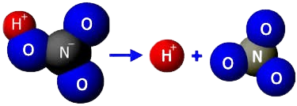

# Plusy i minusy jonów

Aniony, kationy i przewodzenie prądu przez roztwory

---

## Plusy i minusy... co?

Nazywając jony „plusami” i „minusami”, mamy na myśli ich ładunek elektryczny. Jony to nic innego jak atomy mające ładunek. Zachowują się więc jak elektrody, i dzielimy je na kationy i aniony.

---

## „Plusy”, czyli kationy

Kationy to jony o dodatnim ładunku elektrycznym. Powstają w wyniku oderwania się jednego lub więcej elektronów od atomu.

- Na⁺ (sód)
- Ca²⁺ (wapń)
- H⁺ (proton, często spotykany w kwasach)

---

## „Minusy”, czyli aniony

Aniony to jony o ujemnym ładunku elektrycznym. Są to atomy, które przyjęły jeden lub więcej elektronów.

- Cl⁻ (jon chlorkowy)
- OH⁻ (jon wodorotlenowy)
- SO₄²⁻ (jon siarczanowy)

---

## Co to jest dysocjacja elektrolityczna?

Dysocjacja elektrolityczna to proces, w którym substancja (zwykle sól, kwas lub zasada) rozpuszczona w wodzie rozdziela się na jony. Roztwór elektrolitu przewodzi prąd elektryczny, ponieważ zawiera swobodne jony.

- NaCl → Na⁺ + Cl⁻ (chlorek sodu)
- HCl → H⁺ + Cl⁻ (kwas solny)

---

## Co to jest przewodzenie prądu przez roztwory?

Przewodzenie prądu elektrycznego przez roztwór elektrolitu odbywa się dzięki swobodnym jonom. Kiedy na roztwór elektrolitu przyłożymy różnicę potencjałów (np. podłączymy go do źródła prądu), jony zaczną się przemieszczać w stronę przeciwnych elektrod (anody i katody).

- Kationy (jony dodatnie) przemieszczają się w stronę katody (elektrody ujemnej).
- Aniony (jony ujemne) przemieszczają się w stronę anody (elektrody dodatniej).

---

## Przykłady substancji przewodzących prąd

- **Kwas solny (HCl)**: Silny elektrolit, który całkowicie dissocjuje w wodzie, tworząc H⁺ i Cl⁻.
- **Sól kuchenna (NaCl)**: Dysocjuje na Na⁺ i Cl⁻, przewodząc prąd elektryczny.
- **Soda oczyszczona (NaHCO₃)**: Podczas rozpuszczania w wodzie, tworzy jony Na⁺, HCO₃⁻ i OH⁻.

---

## Dlaczego woda przewodzi prąd?

Czysta woda (H₂O) ma bardzo słabą zdolność przewodzenia prądu, ponieważ zawiera jedynie bardzo małą ilość jonów. Jednak, jeśli rozpuścimy w niej jakikolwiek elektrolit (np. sól, kwas lub zasadę), liczba jonów wzrasta, co pozwala na przewodzenie prądu.

---

## Podsumowanie

Jony odgrywają kluczową rolę w przewodzeniu prądu elektrycznego przez roztwory. Kationy i aniony, tworząc roztwory elektrolitów, umożliwiają przepływ prądu, co znajduje szerokie zastosowanie w wielu dziedzinach, od chemii po elektrochemie i technologie energetyczne.

---

## Dziękujemy za uwagę!
