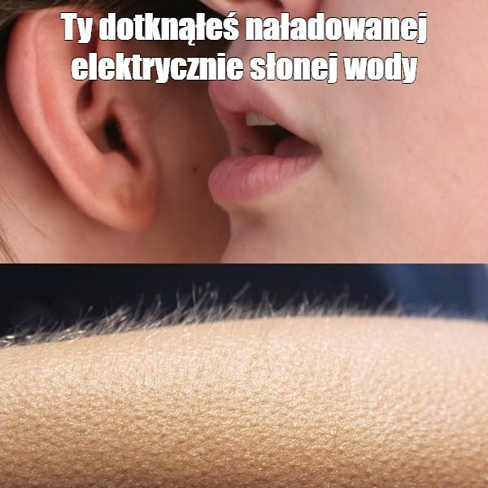
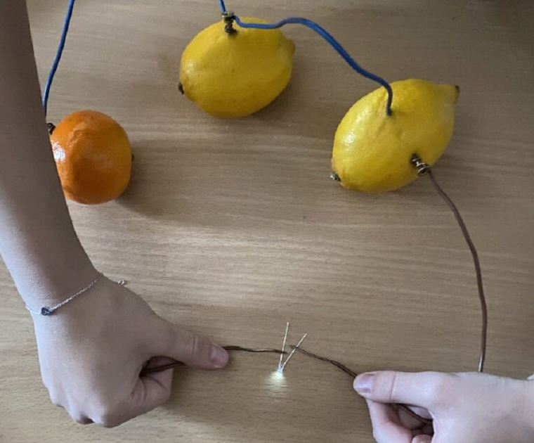
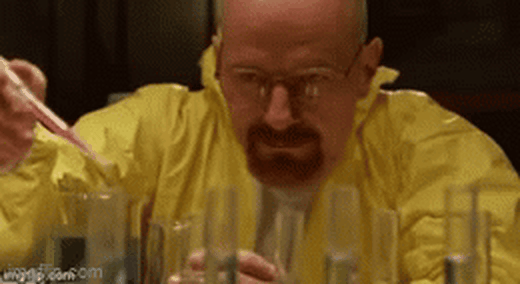

# Plusy i minusy jonów
Aniony, kationy i przewodzenie prądu przez roztwory

---

## Plusy i minusy... co?
Nazywając jony „plusami” i „minusami”, mamy na myśli ich ładunek elektryczny. Jony to nic innego jak atomy mające ładunek. Zachowują się więc jak elektrody, i dzielimy je na kationy i aniony.

---

## „Plusy”, czyli kationy
Kationy to jony o dodatnim ładunku elektrycznym. Powstają w wyniku oderwania się jednego lub więcej elektronów od atomu.

- Na⁺ (sód)
- Ca²⁺ (wapń)
- H⁺ (proton, często spotykany w kwasach)

---

## „Minusy”, czyli aniony
Aniony to jony o ujemnym ładunku elektrycznym. Są to atomy, które przyjęły jeden lub więcej elektronów.

- Cl⁻ (jon chlorkowy)
- OH⁻ (jon wodorotlenowy)
- SO₄²⁻ (jon siarczanowy)

---

## Co to jest dysocjacja elektrolityczna?
Dysocjacja elektrolityczna to proces, w którym cząsteczki substancji rozkładają się na jony pod wpływem rozpuszczalnika, zwykle wody. Substancje, które ulegają dysocjacji, nazywane są elektrolitami i mogą przewodzić prąd elektryczny w roztworze.

Przykład reakcji: `NaCl → Na⁺ + Cl⁻`. Chlorek sodu (NaCl) rozdziela się na jony sodu (Na⁺) i chlorku (Cl⁻), co pozwala roztworowi przewodzić prąd elektryczny.

---

## Rodzaje dysocjacji elektrolitycznej
Istnieją trzy główne typy dysocjacji elektrolitycznej:

1. **Dysocjacja soli**  
   Przykład dysocjacji soli:  
   `NaCl → Na⁺ + Cl⁻`  
   **Anion**: Cl⁻ (jon chlorkowy)  
   **Kation**: Na⁺ (jon sodowy)

2. **Dysocjacja kwasu**  
   Przykład dysocjacji kwasu:  
   `HCl → H⁺ + Cl⁻`  
   **Anion**: Cl⁻ (jon chlorkowy)  
   **Kation**: H⁺ (jon wodoru)

3. **Dysocjacja zasady**  
   Przykład dysocjacji zasady:  
   `NaOH → Na⁺ + OH⁻`  
   **Anion**: OH⁻ (jon wodorotlenowy)  
   **Kation**: Na⁺ (jon sodowy)

---

## Wyjątki w dysocjacji zasad
Niektóre zasady, takie jak KOH (wodorotlenek potasu) i Ca(OH)₂ (wodorotlenek wapnia), ulegają specjalnym reakcjom dysocjacji:

- **KOH**: `KOH → K⁺ + OH⁻`
- **Ca(OH)₂**: `Ca(OH)₂ → Ca²⁺ + 2OH⁻`

W przypadku tych związków, różna liczba jonów wodorotlenowych (OH⁻) uwalnia się podczas dysocjacji, co wpływa na ich właściwości chemiczne.

---

## Przewodnictwo prądu przez roztwory elektrolitów
Roztwory elektrolitów zawierają jony, które mogą poruszać się pod wpływem pola elektrycznego. Kiedy taki roztwór jest podłączony do źródła prądu, jony zaczynają przemieszczać się w kierunku odpowiednich elektrod, umożliwiając przewodzenie prądu.

W przeciwieństwie do elektrolitów, substancje nieelektrolityczne (np. cukier, alkohol) nie dysocjują na jony i nie przewodzą prądu.

---

## Właściwości elektrolitów i nieelektrolitów

| Rodzaj        | Przewodnictwo elektryczne | Przykłady                                   |
|---------------|--------------------------|---------------------------------------------|
| Elektrolity   | Przewodzą prąd elektryczny | Kwasy (HCl), zasady (NaOH), sole (NaCl)    |
| Nieelektrolity | Nie przewodzą prądu       | Cukier, alkohol, woda destylowana          |

---

## Eksperymenty z przewodnictwem prądu
Eksperymenty z przewodnictwem prądu przez roztwory pozwalają na badanie, jak różne substancje przewodzą prąd elektryczny w roztworach wodnych.

- **Roztwór NaCl**: NaCl w wodzie rozdziela się na jony Na⁺ i Cl⁻, co pozwala na przewodzenie prądu.
- **Roztwór cukru**: Cząsteczki cukru nie dysocjują na jony, dlatego roztwór nie przewodzi prądu.

---

## Nie uwierzę, dopóki tego nie zobaczę!
Możesz to sprawdzić sam! Czy wiesz, że można stworzyć wlasną baterię z owocu?

W tym ekperymencie wykorzystujemy właściwości jonów. Elektrody, takie jak cynk (działający jako elektroda ujemna) i miedź (elektroda dodatnia), zanurzamy w kwaśnym środowisku, takim jak sok z cytryny, jabłka czy ziemniaka.

Kwas lub inne elektrolity w owocu pozwalają na przemieszczanie się jonów pomiędzy elektrodami, co generuje prąd.

- **Cynk** działa jako anion (utlenianie- utrata elektronów).
- **Miedź** działa jako kation (redukcja - przyjmowanie elektronów).

Wynik? Niewielkie napięcie, które można zmierzyć dołączonym woltomierzem, a nawet zasilić małą diodę LED.

---

## Podsumowanie
Jony, czyli naładowane atomy lub grupy atomów, odgrywają kluczową rolę w chemii i fizyce. Kationy (dodatnie) i aniony (ujemne) powstają przez utratę lub przyjęcie elektronów. Dysocjacja elektrolityczna pozwala substancjom, takim jak kwasy, zasady i sole, rozpadać się na jony w wodzie, co umożliwia przewodzenie prądu elektrycznego.

Jony są nie tylko nośnikami ładunku, ale także kluczowym elementem reakcji chemicznych, które napędzają życie codzienne i technologie, np. tworzenie prądu w eksperymentach z owocami.

---

## Czy napewno wszystko zrozumiał?
Spróbuj rozwiązać poniższe zadania:

1. Podaj, czy roztwór NaOH będzie przewodził prąd i dlaczego?
2. Co się stanie, gdy rozpuścimy w wodzie alkohol etylowy? Czy będzie przewodził prąd?

### Odpowiedzi:

1. **Odpowiedź**: Roztwór NaOH przewodzi prąd, ponieważ NaOH dysocjuje na jony Na⁺ i OH⁻ w wodzie, umożliwiając przepływ prądu.
2. **Odpowiedź**: Alkohol etylowy nie przewodzi prądu, ponieważ nie dysocjuje na jony w wodzie, a więc nie ma swobodnych nośników ładunków elektrycznych.

---

## Dziękujemy za uwagę!

Źródła:
- [Źródło 1](https://zsp10.pless.pl/2024/02/plusy-i-minusy-jonow/)
- [Źródło 2](https://www.youtube.com/@PistacjaChemia)
- [Źródło 3](https://chemmaster.pl/dysocjacja-jonowa-i-elektrolityczna-roznice-zastosowanie-typy-dysocjacji/?srsltid=AYJSyKwwQU57Bd4AF8IJMmgI7K39L6S35fijJJG0taw7q94bKhwsO5SvmYw)
- [Źródło 4](https://science.vancouver.wsu.edu/chemistry/experimental-chemistry/instrumentation/jonization/)
- [Źródło 5]([https://science.vancouver.wsu.edu/chemistry/experimental-chemistry/instrumentation/jonization/](https://chatgpt.com))
